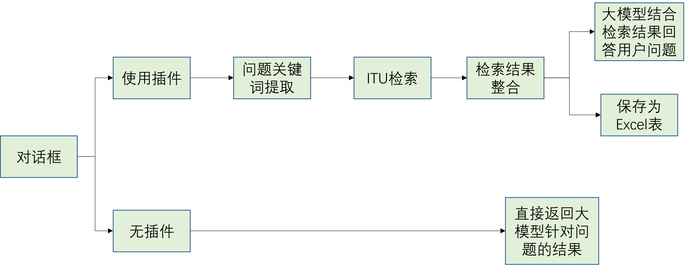
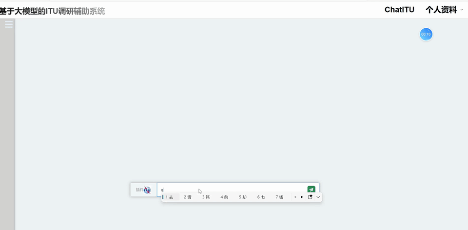
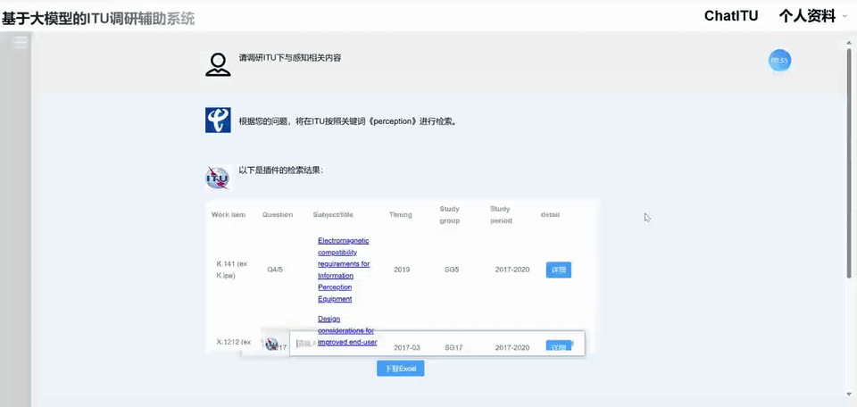
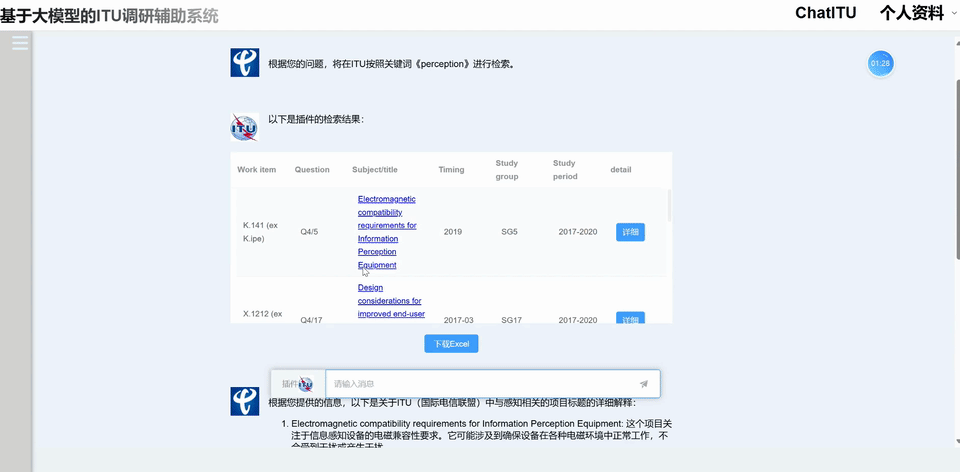
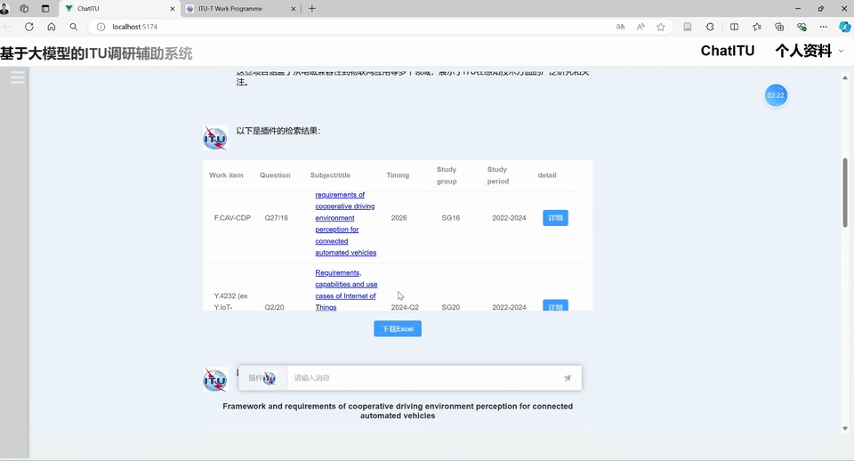

# ChatITU 基于大模型的ITU调研辅助系统 

<div style="font-size: 1.5rem;">
  <a href="./README.md">中文</a> |
  <a href="./readme_en.md">English</a>
</div>
</br>

本项目基于星火大模型接口实现。前端基于VUE3和ElementUI编写，后端基于Python。

**功能概览**


该项目的功能流程图如上图所示。具体功能可分为如下四个步骤。

1. 提问和检索

    用户在输入框输入问题。大模型首先根据问题判断该问题是否需要在ITU进行检索，如果需要检索，则大模型输出检索英文关键词。然后，自研插件在ITU进行检索，并返回与关键词相关的提案/标准。



2. 检索结果总结

    大模型自动对检索结果进行总结。



3. 详细信息查看

    通过点击检索结果中的标准标题，跳转到ITU官网该标准的详细页面。或者点击检索结果表格右侧的详细按钮，在本页面直接查看对应标注的详细信息。



4. 检索表格下载

    下载检索结果所有条目的详细信息整合成的Excel表。



## 安装

前端页面采用 VUE3 构建；后端使用 Python。

### 前端页面
请自行安装 nodejs v16.17.0 +

使用如下命令启动服务

```
cd ./vue
npm run dev
```

### 后端
请自行配置 Python 3.8 + 环境

使用如下命令安装 Python 包

```
pip install -r requirements.txt
```

使用如下命令启动服务

```
python main.py
```

### LLM 接口管理

基于星火模型需要在以下文件中相应位置配置 API Key

* ./LLM/SparkWS.py

### 环境配置教程
更详细的环境配置教程可参见 https://github.com/JayceNing/ChatITU/blob/master/Docs/environment_setup.md

## 快速使用

本应用已部署至公网

访问 http://121.43.42.18:5174/

## 贡献者

<a href="https://github.com/JayceNing/ChatBrain/graphs/contributors">
  
</a>

Jayce Ning

个人主页：https://jaycening.github.io/zh-cn/

Github：https://github.com/JayceNing

知乎：https://www.zhihu.com/people/XinyuNing

## 项目引用

如果你觉得这个仓库很有价值，请给它打个星!

如果您使用此项目中的数据或代码，请引用此项目。

```
@misc{ChatITU,
  author={Xinyu Ning},
  title = {ChatITU: The ITU Research Assistance System Based on LLM.},
  year = {2024},
  publisher = {GitHub},
  journal = {GitHub repository},
  howpublished = {\url{https://github.com/JayceNing/ChatITU}},
}
```

## 致谢

* 本项目是本人在电信研究院移动与终端研究所实习所做，感谢研究所的各位老师！